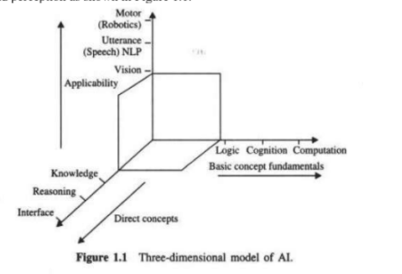

# Research On Artificial Intelligence

# Definition
The art and science of bringing learning, adaptation and self-organization to the machine is the act of
artificial intelligence. Artificial intelligence, in essence, is not only the science of computation but also the
logic of cognition.

# Core Components of AI
The core components and constituents of AI are derived from the concept of logic, cognition and
computation; and the compound components, built-up through core components are knowledge, reasoning,
search, natural language processing, vision,

#### Cognitive Science
The concepts of cognitive science are of two types: one is functional which includes learning, adaptation
and self-organization, and the other is memory and perception which are physical entities.

The physical entities generate some functions to make the compound components.
The compound components are made of some combination of the logic and cognition stream.

#### Fun Facts

1. For AI based game playing problem solution – *AND/OR, minmax and Alpha-beta methods are utilized.*
2. Chess and Checkers types of games are based on *exhaustive search algorithm.*
3. The AND/OR graph, minmax and alpha beta are the **problem reduction methods** which are deployed in game playing 
problems such as Chess, Rubik Cube, Othello, Go and Legistello.
4. IDA*- Iterative Deepening Algorithm A* -> more suitable for finding optimal path in search mechanism
5. Rubik’s cube -> solved by search methods
6. O’thello or Logistello -> solved by Min Pro cut strategy
7. Blue deep has developed special purpose hardware for Chess playing
8. SPAR – Strategic Positioning using Attraction and Repulsion - method for deciding the placements of players
9. Robotic Soccer is an application demonstrating integration of methods from AI, Robotics and vision. 
10.RoboCup started the international competition of Robotic Soccer. Robot has a CPU which can process 100-200 
million instructions per second (MIPS), and Main memory is 16-32 MB. 😮

#### Gaming in AI

1. **The AND/OR graph** is implemented for the problem reduction mechanism.
A problem is decomposed into several sub-problems and the sub-problems are further decomposed into a 
lower unit or with lower complexity, and hence the decomposition continues level by level.
Aproblem is decomposed into three-problems: P, Q and R. 
The two subproblems Q and R are in conjunction, whereas P is independent of Q and R. 
Further, P and Q are decomposed into (M, N) and (O, L). 
This is called AND OR graph because some of the nodes are in conjunction and some are independent.

2. A Tic-Tac-Toe problem is taken into consideration for showing the use of minimax problem.
The evaluation function e(p) for a position is given by:
e{p) = a if p is a win for PLUS e(p) = -a if p is a win for MINUS
e(p) = (the number of complete rows, columns or diagonals that are still open for PLUS) - (the number of complete rows, columns or diagonals that are still open for MINUS)

3. Iteration in IDS
 - It is an iterative process of search in which at each iteration, the search moves to the next deeper
level by discarding the nodes searched in the previous iteration or level.
- It means it starts with depth search to a depth of one ply.
- And after applying its static evaluation function to the results of each of its node, 
it then starts search over depth of second ply. 
- If goal is not achieved, then it discards all nodes generated and moves to the next ply.
- The Iterative Deepening is useful in game playing, because most of the game playing programs are time constrained.
- With the Iterative Deepening, the current search can be stopped, at any time and the best move found by the previous iteration can be played.
- The alpha-beta procedure can print many more branches with effective ordering and total search time can be 
  decreased drastically, resulting in more time for further iterations.
- **A combination of depth first and breadth search was also developed naming depth-first iterative deepening (DFID).**

- *The demerit of this algorithm is that it performs warded computations before reaching a goal depth.*
- It is optimal over depth first and breadth first search methods; the time and space complexities of this search are 0(bd) and 0(d), respectively.
- The performance of A* may be improved by using iterative deepening, as its large memory requirement is reduced considerably.
- This is called **IDA* algorithm** which is widely used in robotics path planning and other
games of large search origin.

# References 
- Google 
- ebook 

